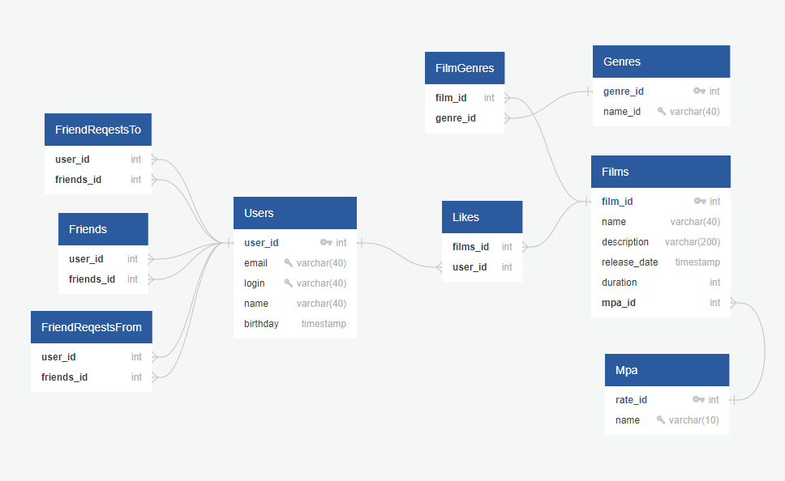

# java-filmorate
<h1>Filmorate</h1>
<h3>Стек:</h3>
<ul>
  <li>JavaCore</li>
  <li>Git</li>
  <li>Spring Boot</li>
  <li>Hibernate</li>
</ul>

В проект добавлена следующая функциональность:

    1) Добавление режиссёров в фильмы - 
        ответственный Никита Миронов (ветка add-director);
    2) Новая функциональность "Отзывы" - 
        ответственный Андрей Устюжанин (ветка add-reviews);
    3) Вывод самых популярных фильмов по жанру и годам - 
        ответственный Алексей Шумилин (ветка add-most-populars);
    4) Удаление фильмов и пользователей - 
        ответственный Константин Комиссаренко (ветка add-remove-endpoint);
    5) Функциональность «Поиск» - 
        ответственный Максим Павлишин (ветка add-search);
    6) Функциональность «Общие фильмы» - 
        ответственный Константин Комиссаренко (ветка add-remove-endpoint);
    7) Функциональность «Лента событий» - 
        ответственный Евгений Михеев (ветка add-feed);
    8) Функциональность «Рекомендации» - 
        ответственный Евгений Михеев (ветка add-feed).

